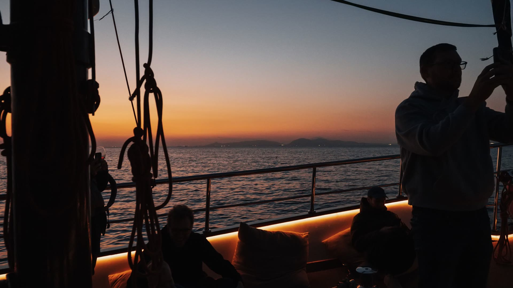

<div align="center">



# ⚓ Aventis Yacht — Sunny Beach

### Bespoke private luxury yacht charters on the Bulgarian Black Sea coast

A hand-crafted, bilingual, single-page marketing site for a luxury yacht-charter brand — built with vanilla web technologies, a cinematic scroll-driven hero, and a meticulous, accessibility-first design system.

<br />

<a href="https://aventis-yacht-sunny-beach.netlify.app">
  
</a>

<br /><br />


</div>

---

## 📖 Overview

**Aventis Yacht — Sunny Beach** is a premium, editorial one-page website presenting a private yacht-charter brokerage on Bulgaria's southern Black Sea coast. It is intentionally **dependency-light**: no framework, no bundler, no build step — just clean HTML, CSS and modern vanilla JavaScript, so it clones and runs anywhere in seconds.

The experience is anchored by a **scroll-scrubbed cinematic hero** (a pre-rendered frame sequence painted onto a `<canvas>`), a fully **bilingual interface** (Bulgarian by default, English on demand), and a cohesive, hand-tuned **design system**.

## ✨ Features

| | Feature | Details |
|---|---|---|
| 🎬 | **Cinematic hero** | Scroll-driven `<canvas>` frame-scrubber (240 pre-rendered frames) for a smooth, video-like intro without a heavy `<video>` tag |
| 🌐 | **Bilingual i18n** | 🇧🇬 Bulgarian / 🇬🇧 English via a segmented-pill switcher; choice persisted in `localStorage`; every string, meta & hero stage localized |
| 🛥️ | **Fleet showcase** | Tabbed yacht categories (motor, sailing, catamaran) with clickable, keyboard-accessible cards |
| 🗺️ | **Destinations** | Swiper carousel of the Bulgarian Black Sea trio — **Sunny Beach · Sozopol · Primorsko** |
| 💬 | **Testimonials** | Auto-playing Swiper slider with unique guest portraits |
| 🪟 | **Modals** | Search, booking-enquiry and yacht-detail dialogs |
| 📊 | **Animated stats** | Count-up counters revealed on scroll |
| ♿ | **Accessibility-first** | Visible `:focus-visible` rings, ARIA labelling, AA colour contrast, reduced-motion aware, `lang` toggling |
| 📱 | **Fully responsive** | Tuned breakpoints at 1280 / 992 / 768 / 480 with a robust mobile header & drawer |
| 🔍 | **SEO ready** | Open Graph + Twitter cards, canonical URL, and `schema.org` structured data |

## 🧰 Tech Stack

- **HTML5** — semantic, accessible markup
- **CSS3** — custom-property design tokens, CSS grid & flexbox, `aspect-ratio`, container-tuned responsive layers
- **Vanilla JavaScript (ES5-safe, IIFE-modular)** — no framework, no transpiler
- **[Swiper 11](https://swiper.uk/)** — touch sliders (loaded from CDN)
- **Google Fonts** — *Cormorant Garamond* (display serif) + *Inter* (UI sans)
- **Netlify** — static hosting & continuous deployment from `main`

## 📁 Project Structure

```
.
├── index.html            # Single-page markup: all sections, modals, structured data
├── css/
│   ├── style.css         # Design system + component styles
│   └── responsive.css    # Breakpoint layers (1280 / 992 / 768 / 480)
├── js/
│   ├── canvas-hero.js    # Scroll-scrubbed <canvas> hero frame player
│   ├── i18n.js           # BG/EN dictionary + language switch (default BG)
│   └── main.js           # Header, scroll-reveal, stat counters, tabs, Swiper, modals
├── frames/               # 240 pre-rendered hero frames (JPEG sequence)
├── images/               # Photography, logo, favicons, icons
└── hero_video.mp4        # Source clip for the frames (git-ignored)
```

## 🚀 Getting Started

No install, no build — but the hero fetches frames over HTTP, so **serve the folder** rather than opening `index.html` from the filesystem (`file://` blocks those requests).

```bash
# clone
git clone https://github.com/Niko5886/Aventis-Yacht-SUNNY-BEACH.git
cd Aventis-Yacht-SUNNY-BEACH

# serve on http://127.0.0.1:5500  (pick any one)
python -m http.server 5500          # Python 3
npx serve -l 5500                    # Node
php -S 127.0.0.1:5500                # PHP
```

Then open **http://127.0.0.1:5500/** and toggle **BG / EN** from the header.

> 💡 `hero_video.mp4` is the *source* of the hero and is intentionally git-ignored — the committed `frames/` sequence is all the site needs to run.

## 🌐 Internationalization

All copy lives in a single dictionary in [`js/i18n.js`](js/i18n.js). Elements opt in declaratively:

```html
<h2 data-i18n="about_title">A Legacy of Pure Maritime Luxury</h2>
<p  data-i18n-html="cta_title">The Sea Awaits.<br />Plan Your Bespoke Escape.</p>
```

- **`data-i18n`** — replaces `textContent`
- **`data-i18n-html`** — replaces `innerHTML` (for strings with markup)
- **`data-i18n-ph`** — localizes an `input` placeholder

Language defaults to **Bulgarian** and is saved under the `aventis_lang` key in `localStorage`.

## 🎨 Design System

Design tokens are defined as CSS custom properties in `:root`:

| Token | Value | Role |
|---|---|---|
| `--color-navy-dark` | `#070F17` | Ink / dark sections |
| `--color-cream` | `#FAF8F5` | Light section canvas |
| `--color-gold` | gold accent | CTAs, eyebrows, hovers |
| `--font-serif` | Cormorant Garamond | Display headings |
| `--font-sans` | Inter | Body & UI |

Convention: **navy text on gold surfaces** for WCAG-AA contrast.

## ♿ Accessibility

- Visible `:focus-visible` focus rings across interactive elements
- ARIA labelling on the hero, nav controls and icon buttons
- AA-compliant colour contrast (incl. navy-on-gold)
- `prefers-reduced-motion` honoured (autoplay & animation guarded)
- `<html lang>` updated live on language switch

## 🚢 Deployment

The site is a static bundle hosted on **Netlify**, live at **[aventis-yacht-sunny-beach.netlify.app](https://aventis-yacht-sunny-beach.netlify.app)**.

Deploys are published from a clean dist folder via the Netlify CLI:

```bash
# upload only the static files (never the whole repo root — that would
# include .git and the 20 MB git-ignored hero_video.mp4)
netlify deploy --prod --dir=<clean-dist>
```

> There is no build step, so deploys are near-instant. To enable automatic deploys on every `git push`, connect the repo in the Netlify dashboard (build command: none · publish directory: repo root), then simply batch commits into one push to keep build usage minimal.

## 🖼️ Image Credits

| Image | Author | License |
|---|---|---|
| Sozopol — *The Bay from Above* | Daniel Albrecht | CC BY 2.0 (Wikimedia Commons) |
| Primorsko — *South Beach* | TodorBelomorski | CC BY-SA 4.0 (Wikimedia Commons) |
| About — shore & liner | Margo Evardson | Unsplash |

Remaining photography, the logo and icons are project/stock assets. When deploying publicly, ensure the CC-licensed photos above carry their required attribution.

## 📄 License

© 2026 **Aventis Yacht — Sunny Beach**. All rights reserved.
This repository is proprietary; no open-source license is granted. Please contact the author before reuse.

## 👤 Author

**Designed & built by N. Stoyanov**

<div align="center">

<sub>Crafted with care on the Black Sea coast 🇧🇬</sub>

</div>
